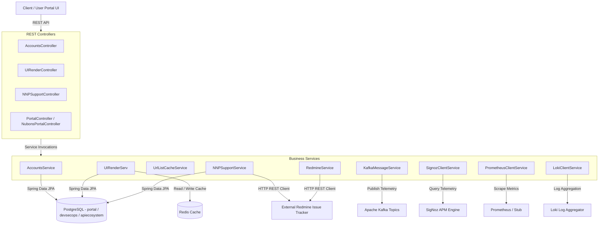
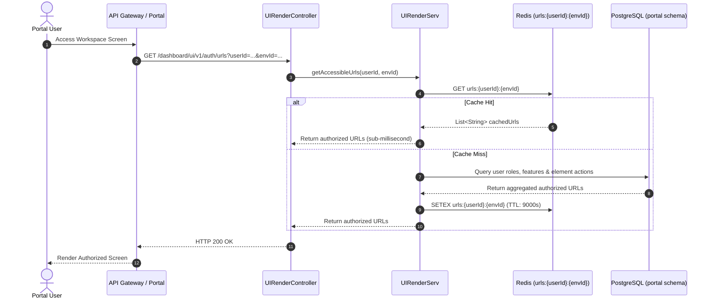

# PICC-PP-User-Portal-Backend

[](https://openjdk.org/projects/jdk/21/)
[](https://spring.io/projects/spring-boot)
[](https://www.postgresql.org/)
[](https://redis.io/)
[](https://kafka.apache.org/)
[](LICENSE)
[]()

Enterprise-grade Spring Boot microservice providing centralized multi-tenant workspace environment management, subscription plan billing, dynamic UI navigation tree rendering, Redis-backed screen authorization, automated Redmine support ticket lifecycle integration, and real-time Kubernetes observability telemetry (SigNoz, Prometheus, Loki, and Apache Kafka).

Part of the **Platform Infrastructure and Core Components (PICC)** layer of the **Nubo Native Platform (NNP)**.

---

## Table of Contents

- [Overview](#overview)
- [Key Features](#key-features)
- [Architecture & Low-Level Design (LLD)](#architecture--low-level-design-lld)
  - [System Component Architecture](#system-component-architecture)
  - [User URL Accessibility & Redis Caching](#user-url-accessibility--redis-caching)
- [Technology Stack](#technology-stack)
- [Quick Start & Local Development](#quick-start--local-development)
  - [Prerequisites](#prerequisites)
  - [Configuration Setup](#configuration-setup)
  - [Running via Docker Compose](#running-via-docker-compose)
  - [Running via Maven Wrapper](#running-via-maven-wrapper)
- [Configuration Reference](#configuration-reference)
- [API Documentation](#api-documentation)
- [Security & Compliance](#security--compliance)
- [Contributing & Community](#contributing--community)
- [License](#license)

---

## Overview

The **NNP User Portal Backend** (`PICC-PP-User-Portal-Backend`) functions as the core control plane and orchestration backbone for tenant-facing portal interfaces. It isolates multi-tenant environments, configures fine-grained user accessibility features, tracks resource utilization across Kubernetes namespaces, publishes telemetry streams to Apache Kafka, and synchronizes support ticket workflows with Redmine.

---

## Key Features

1. **Multi-Tenant Account & Billing Management**
   - Manage tenant account profiles, subscription components, balance logs, and invoice line items.
   - Configure component-level routing proxy endpoints per tenant environment.

2. **Dynamic UI Navigation Hierarchy (V1 / V2 / V3)**
   - Dynamically render multi-tiered environment navigation trees: `Environment` → `EnvFeature` → `FeatureElement` → `ElementDetail` → `CHElementDetail`.
   - Dynamic user role assignment and homelink generation per environment.

3. **High-Performance User Accessibility Authorization**
   - Real-time verification of user access permissions for application screens and URLs.
   - Accelerated via Redis caching (`urls:{userId}:{envId}`) with 2.5-hour TTL and automated invalidation.

4. **Automated Support Ticket Lifecycle (Redmine Integration)**
   - Pre-loads Redmine metadata (trackers, categories, priorities, statuses, parent issues) during startup.
   - Create, update, and fetch tickets directly synchronized with external Redmine trackers (Epics, Bugs, Support Tickets).
   - Historical support trend analysis over custom month windows.

5. **Observability Telemetry & Resource Prediction Streaming**
   - Scheduled collection of Kubernetes pod CPU, memory, and storage metrics via SigNoz APM.
   - Paced namespace-chunked pod metric streaming via Apache Kafka for downstream ML prediction models.
   - Dual-mode metric engine supporting live Prometheus scraping or mock stubbing for isolated local development.

---

## Architecture & Low-Level Design (LLD)

### System Component Architecture



### User URL Accessibility & Redis Caching



---

## Technology Stack

| Component | Technology | Version / Spec |
| :--- | :--- | :--- |
| **Runtime** | Eclipse Temurin OpenJDK | 21 LTS |
| **Framework** | Spring Boot | 3.4.1 |
| **Persistence** | Spring Data JPA / Hibernate | PostgreSQL 16 (Multi-Schema) |
| **Caching** | Spring Data Redis (`StringRedisTemplate`) | Redis 7+ |
| **Streaming** | Spring Kafka (`KafkaTemplate`) | Apache Kafka 3.x |
| **Observability** | SigNoz, Prometheus, Loki | OpenTelemetry Standards |
| **External Issue Tracker** | Spring WebFlux / Reactive WebClient | Redmine REST API |
| **API Docs** | SpringDoc OpenAPI / Swagger UI | OpenAPI 3.0 |
| **Security SAST** | SpotBugs + FindSecBugs | 4.8.6 / 1.13.0 |
| **SBOM** | CycloneDX Maven Plugin | 2.9.1 (Spec 1.5) |

---

## Quick Start & Local Development

### Prerequisites
- **JDK 21** installed (`java -version`).
- **Docker & Docker Compose** installed.
- **Maven 3.9+** (or use the included `./mvnw`).

### Configuration Setup
Copy the environment template and customize as required:
```bash
cp .env.example .env
```

### Running via Docker Compose
To launch the complete local ecosystem (Backend, PostgreSQL, Redis, Kafka, Zookeeper):
```bash
docker-compose up -d
```

Check container health:
```bash
docker-compose ps
```

### Running via Maven Wrapper
To run the service locally against your configured services:
```bash
# On Linux / macOS:
./mvnw clean spring-boot:run

# On Windows:
.\mvnw.cmd clean spring-boot:run
```

---

## Configuration Reference

Key configuration parameters (all configurable via `.env` or system environment variables):

| Environment Variable | Default Value | Description |
| :--- | :--- | :--- |
| `SERVER_PORT` | `8080` | Port on which the microservice listens |
| `SPRING_PROFILES_ACTIVE` | `dev` | Active Spring profile (`dev`, `main`, `local`) |
| `APP_CORS_ALLOWED_ORIGINS` | `http://localhost:3000,http://localhost:5173,http://localhost:8080` | Allowed CORS client origins |
| `SPRING_DATASOURCE_URL` | `jdbc:postgresql://localhost:5432/nnp_portal?currentSchema=portal` | Primary database connection URL |
| `SPRING_DATASOURCE_USERNAME` | `postgres` | Primary database username |
| `SPRING_DATASOURCE_PASSWORD` | `postgres` | Primary database password |
| `REDIS_HOST` | `localhost` | Redis hostname |
| `REDIS_PORT` | `6379` | Redis port |
| `KAFKA_BOOTSTRAP_SERVERS` | `localhost:9092` | Kafka broker bootstrap list |
| `KAFKA_TOPIC_PODUSAGE` | `nnp-pod-usage` | Kafka topic for pod resource metrics |
| `KAFKA_TOPIC_METRICPREDICTION` | `nnp-metric-prediction` | Kafka topic for metric predictions |
| `SIGNOZ_URL` | `http://localhost:3301` | SigNoz APM endpoint URL |
| `PROMETHEUS_URL` | `http://localhost:9090` | Prometheus scraper endpoint |
| `PROMETHEUS_STUB_ENABLED` | `false` | Enable mock metric stub for isolated testing |
| `LOKI_URL` | `http://localhost:3100` | Loki log aggregation URL |
| `REDMINE_URL` | `http://localhost:3000` | Redmine REST API base URL |
| `K8SINTG_SERVICE_URL` | `http://localhost:8082` | Kubernetes Integration Service URL |
| `CONFIG_SERVER_URL` | `http://localhost:8888` | Spring Cloud Config Server URL |
| `LOG_LEVEL` | `INFO` | Root logging level for com.nnp.dashboard |

---

## API Documentation

Once the service is started, interactive Swagger UI documentation and OpenAPI specifications are available at:

- **Swagger UI**: [http://localhost:8080/swagger-ui.html](http://localhost:8080/swagger-ui.html)
- **OpenAPI v3 JSON**: [http://localhost:8080/v3/api-docs](http://localhost:8080/v3/api-docs)
- **Actuator Health Endpoint**: [http://localhost:8080/actuator/health](http://localhost:8080/actuator/health)

---

## Security & Compliance

This repository enforces strict open-source security standards:
- **Zero Committed Secrets**: No passwords, tokens, private keys, or internal IPs are committed.
- **Static Analysis (SAST)**: Verified using SpotBugs and FindSecBugs (`mvn spotbugs:check`).
- **Software Bill of Materials (SBOM)**: Aggregated via CycloneDX (`mvn cyclonedx:makeAggregateBom`).
- **Least-Privilege Containerization**: Runs under unprivileged user `appuser` (UID 1001).

---

## Contributing & Community

Contributions are welcome under the **Apache 2.0 License**!
- Guidelines: [CONTRIBUTING.md](CONTRIBUTING.md)
- Code of Conduct: [CODE_OF_CONDUCT.md](CODE_OF_CONDUCT.md)
- Development Guide: [DEVELOPMENT_GUIDELINES.md](DEVELOPMENT_GUIDELINES.md)
- Deployment & User Manual: [USER_MANUAL_AND_DEPLOYMENT_GUIDE.md](USER_MANUAL_AND_DEPLOYMENT_GUIDE.md)
- Security Policy: [SECURITY.md](SECURITY.md)
- Maintainers: [MAINTAINERS.md](MAINTAINERS.md)

---

## License

Licensed under the **Apache License, Version 2.0**. See the [LICENSE](LICENSE) file for details.
