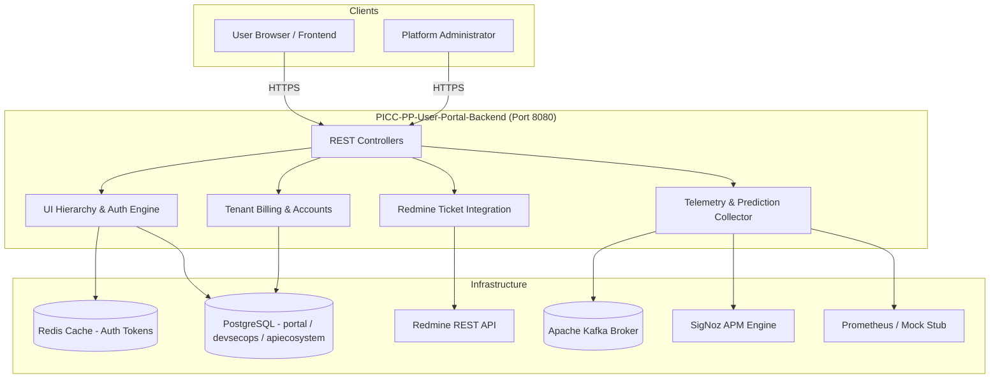

# User Manual and Deployment Guide: `PICC-PP-User-Portal-Backend`

Enterprise operations, architectural workflows, configuration management, and deployment instructions for **`PICC-PP-User-Portal-Backend`**.

---

## Table of Contents

1. [Architecture & System Overview](#1-architecture--system-overview)
2. [Runtime Prerequisites](#2-runtime-prerequisites)
3. [Configuration Reference](#3-configuration-reference)
4. [Deployment Strategies](#4-deployment-strategies)
   - [Local & Standalone Deployment](#local--standalone-deployment)
   - [Docker Compose Deployment](#docker-compose-deployment)
   - [Kubernetes Production Deployment](#kubernetes-production-deployment)
5. [Operational Health & Observability](#5-operational-health--observability)
6. [Troubleshooting & FAQs](#6-troubleshooting--faqs)

---

## 1. Architecture & System Overview

`PICC-PP-User-Portal-Backend` is the primary microservice orchestrating multi-tenant user portal interfaces in the Nubo Native Platform (NNP).



### Key Functional Responsibilities

1. **Dynamic Navigation & Screen Hierarchy**:
   - Assembles multi-level portal navigation trees (`Environment` -> `EnvFeature` -> `FeatureElement` -> `ElementDetail` -> `CHElementDetail`).
   - Evaluates user role permissions and caches authorized URLs in Redis (`urls:{userId}:{envId}`) with an automated 9000-second TTL.

2. **Tenant Accounts & Billing**:
   - Maintains tenant profiles, subscription components, proxy endpoints, payment transaction records, and invoice generation.

3. **Automated Support Ticketing**:
   - Integrates with Redmine REST API to create and retrieve support tickets, bug reports, and project epics.
   - Provides monthly ticket count trends and status distributions.

4. **Resource Telemetry & Prediction Streaming**:
   - Gathers hourly cluster usage (CPU, Memory, Storage, Pod count) and logs.
   - Streams chunked pod telemetry to Kafka topics (`nnp-pod-usage`, `nnp-metric-prediction`) for downstream AI/ML workload prediction.

---

## 2. Runtime Prerequisites

| Component | Minimum Version | Recommended | Notes |
| :--- | :--- | :--- | :--- |
| **Java Runtime (JRE)** | 21 LTS | Eclipse Temurin 21 | Container base image uses `eclipse-temurin:21-jre-jammy` |
| **PostgreSQL** | 14+ | 16 Alpine | Schema `portal`, `devsecops`, `apiecosystem` |
| **Redis** | 6.2+ | 7.x Alpine | Standalone or Redis Sentinel/Cluster |
| **Apache Kafka** | 2.8+ | 3.5+ | Topics: `nnp-pod-usage`, `nnp-metric-prediction` |
| **Docker Engine** | 20.10+ | 24+ | For containerized execution |

---

## 3. Configuration Reference

All settings can be supplied via environment variables or a `.env` file:

```bash
# Server Port & Active Profile
SERVER_PORT=8080
SPRING_PROFILES_ACTIVE=main
CONFIG_LABEL=v1
CONFIG_SERVER_URL=http://nnp-config-service:8080

# CORS Allowed Origins
APP_CORS_ALLOWED_ORIGINS=https://portal.example.com,http://localhost:3000

# PostgreSQL Databases
SPRING_DATASOURCE_URL=jdbc:postgresql://postgres-service:5432/nnp_portal?currentSchema=portal
SPRING_DATASOURCE_USERNAME=postgres
SPRING_DATASOURCE_PASSWORD=StrongPassword123

SPRING_DATASOURCE_DEVSECOPS_URL=jdbc:postgresql://postgres-service:5432/nnp_devsecops
SPRING_DATASOURCE_DEVSECOPS_USERNAME=postgres
SPRING_DATASOURCE_DEVSECOPS_PASSWORD=StrongPassword123

SPRING_DATASOURCE_APIECOSYSTEM_URL=jdbc:postgresql://postgres-service:5432/nnp_apiecosystem
SPRING_DATASOURCE_APIECOSYSTEM_USERNAME=postgres
SPRING_DATASOURCE_APIECOSYSTEM_PASSWORD=StrongPassword123

# Redis Cache
REDIS_HOST=redis-service
REDIS_PORT=6379
REDIS_PASSWORD=

# Kafka Streaming
KAFKA_BOOTSTRAP_SERVERS=kafka-service:9092
KAFKA_TOPIC_PODUSAGE=nnp-pod-usage
KAFKA_TOPIC_METRICPREDICTION=nnp-metric-prediction

# Observability Providers
SIGNOZ_URL=http://signoz-query-service:3301
SIGNOZ_API_KEY=
PROMETHEUS_URL=http://prometheus-service:9090
PROMETHEUS_STUB_ENABLED=false
LOKI_URL=http://loki-service:3100

# Redmine Integration
REDMINE_URL=http://redmine-service:3000
REDMINE_API_KEY=redmineSecretApiKey
REDMINE_BASE_PROJECT_ID=nnp-support

# Logging
LOG_LEVEL=INFO
```

---

## 4. Deployment Strategies

### Local & Standalone Deployment

```bash
# 1. Package the application
./mvnw clean package -DskipTests

# 2. Run the JAR with production parameters
java -XX:+UseContainerSupport \
     -XX:MaxRAMPercentage=75.0 \
     -Dspring.profiles.active=dev \
     -jar target/PICC-PP-User-Portal-Backend-0.0.1-SNAPSHOT.jar
```

### Docker Compose Deployment

The provided `docker-compose.yml` launches the backend along with PostgreSQL, Redis, Kafka, and Zookeeper:

```bash
# Start all services
docker-compose up -d

# View service logs
docker-compose logs -f user-portal-backend

# Stop and clean up
docker-compose down
```

### Kubernetes Production Deployment

Below is a production-grade Kubernetes manifest:

```yaml
apiVersion: apps/v1
kind: Deployment
metadata:
  name: user-portal-backend
  namespace: nnp-core-components
  labels:
    app.kubernetes.io/name: user-portal-backend
    app.kubernetes.io/part-of: nubo-native-platform
spec:
  replicas: 2
  selector:
    matchLabels:
      app: user-portal-backend
  template:
    metadata:
      labels:
        app: user-portal-backend
    spec:
      securityContext:
        runAsNonRoot: true
        runAsUser: 1001
        fsGroup: 1001
      containers:
        - name: user-portal-backend
          image: ghcr.io/nubo-native-platform/picc-pp-user-portal-backend:latest
          imagePullPolicy: IfNotPresent
          ports:
            - containerPort: 8080
              name: http
          envFrom:
            - configMapRef:
                name: user-portal-config
            - secretRef:
                name: user-portal-secrets
          resources:
            requests:
              cpu: 250m
              memory: 512Mi
            limits:
              cpu: 1000m
              memory: 1536Mi
          readinessProbe:
            httpGet:
              path: /actuator/health
              port: 8080
            initialDelaySeconds: 20
            periodSeconds: 10
          livenessProbe:
            httpGet:
              path: /actuator/health
              port: 8080
            initialDelaySeconds: 30
            periodSeconds: 15
---
apiVersion: v1
kind: Service
metadata:
  name: user-portal-backend
  namespace: nnp-core-components
spec:
  type: ClusterIP
  selector:
    app: user-portal-backend
  ports:
    - port: 8080
      targetPort: 8080
      name: http
```

---

## 5. Operational Health & Observability

- **Actuator Health**: `GET /actuator/health` returns status of the service, database connectivity, and Redis cache.
- **Actuator Metrics**: `GET /actuator/metrics` exposes JVM memory, garbage collection, and thread states.
- **Swagger Documentation**: `GET /swagger-ui.html` provides interactive API testing.

---

## 6. Troubleshooting & FAQs

### Q: The service fails to start with "Could not initialize Redmine metadata".
**A**: During startup, `RedmineService` queries Redmine for trackers, categories, and priorities. In this open-source build, initialization exceptions are caught and logged as warnings (`log.warn(...)`), allowing the service to run even if Redmine is temporarily unavailable. Verify `REDMINE_URL` and `REDMINE_API_KEY`.

### Q: CORS error when calling API from frontend browser.
**A**: Ensure `APP_CORS_ALLOWED_ORIGINS` includes the scheme, host, and port of the frontend client (e.g. `http://localhost:3000,http://localhost:5173`).

### Q: Why is Prometheus stubbing enabled?
**A**: Set `PROMETHEUS_STUB_ENABLED=true` for local development when an external Prometheus server is not accessible. Synthetic mock metrics will be returned for CPU, Memory, and Pod counts.
